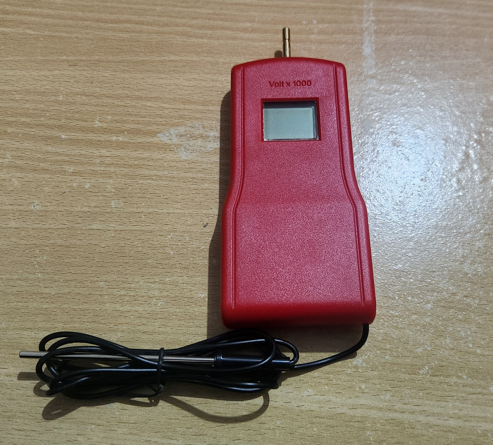
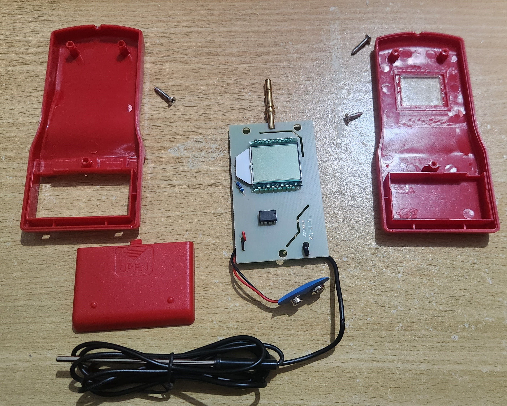
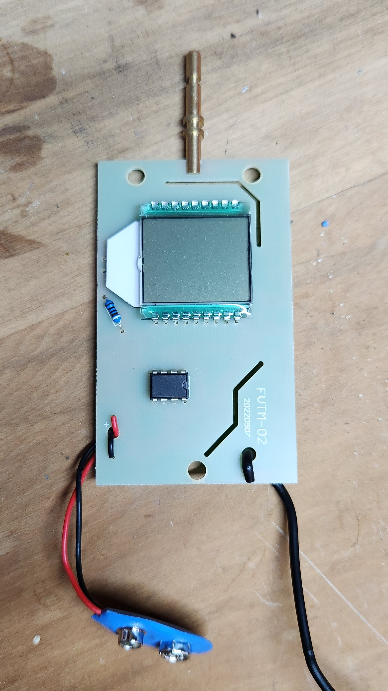
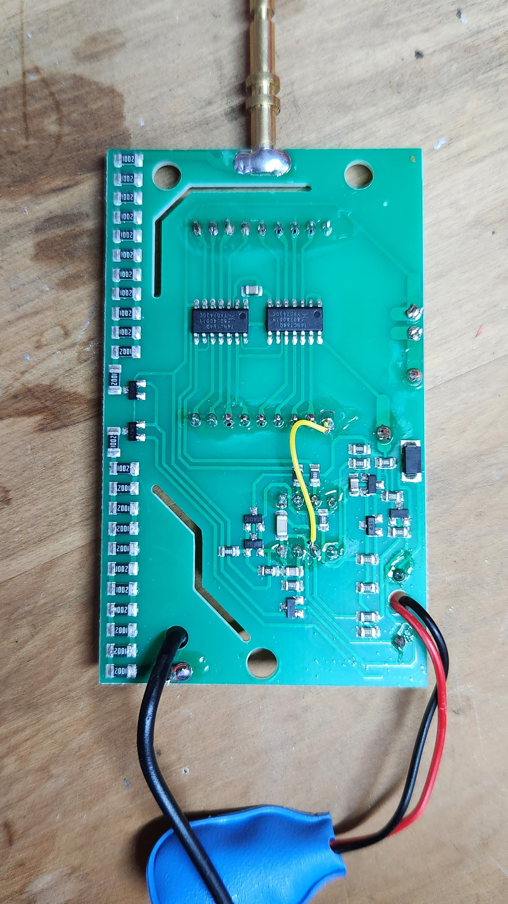
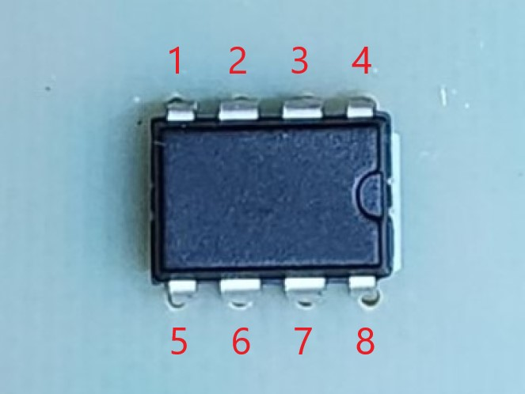
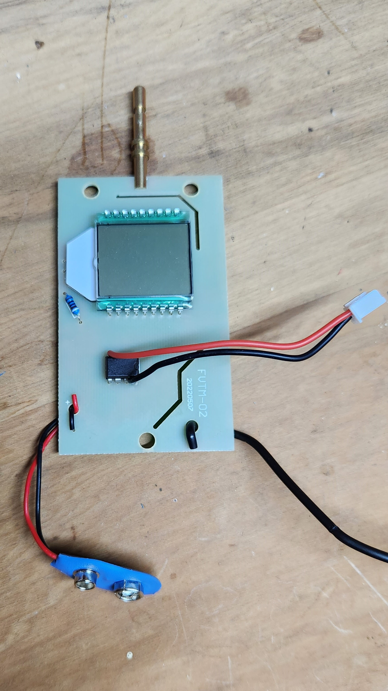
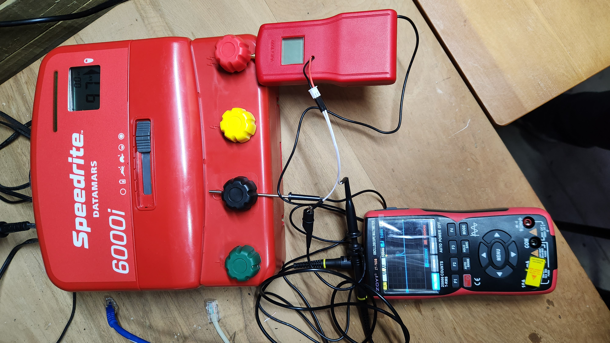

# Smart-Electric-Fence-Voltmeter
An attempt at making a smart electric fence voltmeter

# Preface
This writeup is about the second attempt at the project. On my first attempt, I tried to ego my way through designing my own circuit from scratch despite having zero knowledge in electrical engineering.

Long story short: zero knowledge -> zero results
 - In retrospect, I think my actual problem was that the resistor bank I designed had too much total resistance

# General Approach
For my second attempt, I had the genius idea to cheat. Most fence voltmeters work off the same principle of scaling the voltage down with an analogue circuit and then performing measurements from there.

Thus the plan was to simply:
1. Buy a premade (dumb) fence voltmeter
2. Identify where on the circuit board the scaled down voltage appears at
3. Tack on my own ADC + microcontroller
4. ???
5. Profit

# Step 1: Buying a Fence Voltmeter
Most fence voltmeters would have worked here. I just decided to buy a generic one from Aliexpress.



# Step 2: Identifying the Proxy Voltage
After a quick teardown:


Had a closer look at the circuit board:
 - Front
   
 - Back
   

Despite knowing nothing electrical circuits, I did have a few deductions to make the search go quickly:
 - The scaled down voltage (which I'll refer to as the "proxy voltage") must be measured by an ADC
 - The ADC is likely inbuilt into the microcontroller for something cheap like this
 - The microcontroller requires its own ground reference (seperate from the silver grounding probe) that is likely to just be the 9V negative

Made up a labelling scheme and started stabbing around with a voltmeter/oscilloscope:
 - 
 - Quickly discovered a **continuity between pin 8 and the 9V negative**

After hooking the board up to an electric fence energiser and some more stabbing around, I noticed **strong voltage spikes on pins 1 and pins 4**. (My ground reference being pin 8).

Arbitrarily decided to select pin 1 (and pin 8) for my ADC to hook onto:
 - 

Final checks:
 - 

As can be seen in the picture above, the proxy voltage waveform has some distinct characteristics:
 - Performs a mapping of 10kV spike to a ~0.4V spike
 - Instantaneous rise within ~1ms followed by rapid exponential decay back to baseline in ~50ms

# Step 3: Tack on ADC + Microcontroller
The microcontroller I decided to use before hand was the **esp32-p4-eth** (from waveshare). The esp32 chips famously have an ADC that is basically doodoo so I went with an external module.

To capture the peak of the proxy voltage spike reliably, I had two choices:
 - Sample at >1000 times per second
 - Make an analogue circuit to extend the time of the spike and sample slowly

Clearly one of these options was in dreamland for me. Luckilly fast polling ADC modules are quite common. The two I narrowed down to were:
 - **ADS1115**, 16 bit precision, 860 samples per second
 - **ADS1220**, 24 bit precision, 2000 samples per second

The ADS1220 was clearly the superior choice here. Thus I went with the ADS1115...
 - I wanted to run ESPHome on the esp32-p4 from the very start and only the ADS1115 had mainline support...
 - In the past it seemed there was [a PR](https://github.com/esphome/esphome/pull/6433) to get ADS1220 support into esphome. Within the PR it does [show](https://github.com/esphome/esphome/pull/6433#issuecomment-3287850850) how to pull in the code as an external component. I wasn't planning to take chances though with the project being so close to finished. Will definitely test later some day.

After a few hours tweaking the esphome config, this was my final config:
```
esphome:
  name: fence-energiser-controller
  friendly_name: Fence Energiser Controller
  on_boot:
    - then:
        # Duty timer doesn't have a sensor associated with it so it manually has to be told to start
         - sensor.duty_time.start: pulse_timer

esp32:
  variant: esp32p4
  engineering_sample: true
  framework:
    type: esp-idf

logger:
  hardware_uart: UART0
  level: INFO

api:
  encryption:
    key: "buyinggf"

ota:
  - platform: esphome

ethernet:
  clk:
    mode: CLK_EXT_IN
    pin: GPIO50
  mdc_pin: GPIO31
  mdio_pin: GPIO52
  phy_addr: 1
  power_pin: GPIO51
  type: IP101
  
web_server:

i2c:
  - id: i2c_1
    sda: GPIO02
    scl: GPIO03
    frequency: 200kHz

ads1115:
  - id: ads1115_1
    address: "0x48"
    # Continous mode neeeds to be on for sensor communication stability
    continuous_mode: true

sensor:
  # The raw "proxy" voltage readings
  - platform: ads1115
    id: proxy_voltage
    name: Proxy Voltage
    gain: "0.512"
    multiplexer: A0_GND
    update_interval: 1ms
    filters:
      # Remember that proxy_voltage_baseline uses the raw_state so there is nothing
      # cyclical here
      - offset: !lambda return -(id(proxy_voltage_baseline).get_state() + 0.0003);
      - clamp:
          min_value: 0
      #- round: 4
    sample_rate: "860"
    on_value:
      then:
        - component.update: proxy_voltage_derivative
    accuracy_decimals: 6
    icon: "mdi:alpha-v-circle-outline"

  # Derivative of the proxy voltage. 
  # Adjustment of the baseline between data samples technically affects the 
  # derivative. However once baseline is stable, effect on derivative should be 0.
  - platform: template
    id: proxy_voltage_derivative
    lambda: |-
      static float previous_val = 0.0;
      static float previous_time = 0.0;
      
      float current_time = (float) millis();
      float current_val = id(proxy_voltage).get_state();
      float derivative = (current_val - previous_val) / ((current_time - previous_time)*0.0001);
      
      previous_time = current_time;
      previous_val = current_val;
      return derivative;

  # Floating voltage of the ads1115
  - platform: template
    id: proxy_voltage_baseline
    update_interval: 0.1s
    name: Raw Proxy Float Voltage
    lambda: return id(proxy_voltage).get_raw_state();
    filters:
        - exponential_moving_average:
            alpha: 0.005
            send_every: 1
    accuracy_decimals: 6
    unit_of_measurement: V
    icon: "mdi:wave"

  # Scale the proxy voltage back up to the fence voltage
  # Known datapoints:
  #  - 0.45v -> 10kV
  - platform: copy
    name: Fence Voltage
    id: voltage_scaled
    source_id: proxy_voltage
    filters:
      multiply: 22000
    unit_of_measurement: V
    device_class: voltage
    accuracy_decimals: 0
    icon: "mdi:waveform"

  # Capture rolling window of the maximum of the fence voltage
  - platform: copy
    source_id: voltage_scaled
    id: voltage_scaled_max
    internal: true
    filters: 
      max:
        window_size: 300
        send_every: 1

  # Template sensor so we have control of when we get to publish the maximum fence voltage
  - platform: template
    id: voltage_scaled_max_reported
    name: Fence Voltage Peak
    update_interval: never
    lambda: return id(voltage_scaled_max).get_state();
    unit_of_measurement: V
    device_class: voltage      
    icon: "mdi:wave-arrow-up"

  # Abusing duty_time sensor as a stopwatch
  - platform: duty_time
    name: Time From Last Pulse
    id: pulse_timer
    update_interval: 0.1s
    filters: 
      - clamp:
          # Have an obvious timeout value and stop stopwatch going to infinity 
          # incase a pulse is never received
          max_value: 1000
    on_value_range:
      - below: 0.5
        then:
          - component.suspend: proxy_voltage_baseline
      - above: 0.5
        then:
          - component.resume: proxy_voltage_baseline
    accuracy_decimals: 1
    icon: "mdi:timer"

  - platform: template
    name: Last Duration Between Pulses
    id: pulse_interval
    update_interval: never
    lambda: return id(pulse_timer).get_state();
    accuracy_decimals: 2
    unit_of_measurement: s
    device_class: duration
    icon: "mdi:timer-sand"
    
binary_sensor:
  # Flag for voltage rises
  - platform: analog_threshold
    id: spiking
    sensor_id: proxy_voltage_derivative
    threshold: 20
    filters: 
      # Perform debouncing for flickering that might occur after the rise
      - delayed_off: 0.2s
    on_press:
      - then:
          - logger.log:
              format: Fence pulse detected
              level: INFO
          - component.update: pulse_timer
          - component.update: pulse_interval
          - sensor.duty_time.reset: pulse_timer
          # Voltage rise is (probably?) detected before the peak is fully formed
          - delay: 0.15s
          - logger.log:
              format: Capturing fence pulse voltage peak now
              level: INFO
          - component.update: voltage_scaled_max_reported
```

# Quick Note on the ADS1115
I spent quite a bit of time banging my head in due to having issues with the ADS1115 and default ESPHome config.

I'm not sure if its an issue with ESPHome or how the sensor fundamentally is, but continuous mode seems to be a requirement at high sample rates. At high sample rates on the single shot mode, the sensor seems to "burnout" and pulls the SCL line low after about a minute of operation. A quick power cycle does not clear this. I had to wait ~10min with everything powered off for things to properly reset.
